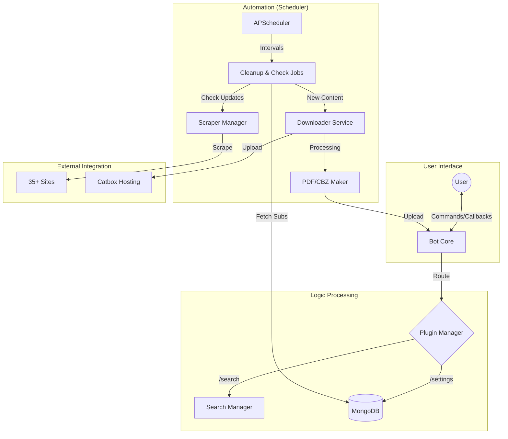

<div align="center">
  

  <br/>

  

  <br/>

  <p align="center">
    
    
    
  </p>

  <h3>One-Click Deploy</h3>
  
  <p>
    <a href="https://heroku.com/deploy?template=https://github.com/KunalG932/auto-manga-chapter-update-bot">
      
    </a>
  </p>
</div>

---

<p align="center">
  
</p>

## What's this?

Hey! This is a powerful Telegram bot designed to make running a manga channel a breeze. Instead of manually checking sites and uploading files, this bot does everything for you—from tracking new chapters to uploading them as clean PDFs.

---

## Cool Features

- **Auto Everything**: It checks 35+ sources every few minutes so you don't have to.
- **Clean Files**: Converts chapters into high-quality PDF or CBZ files automatically.
- **Your Branding**: Add your own watermarks, promo banners, and captions to every post.
- **Smart Tracking**: If one site is down, it checks others to make sure your followers get their fix ASAP.
- **Fast Search**: Built-in search engine to find and track any manga in seconds.
- **Easy Deployment**: Runs on Heroku, VPS, or even your local machine with just a few clicks.

---

## Technical Stuff

```text
Auto Manga Updates   ████████████░░░ 85%
Smart Search Engine  ███████████░░░░ 80%
Plugin Architecture  ██████████████ 100%
Async MongoDB        ████████████░░░ 90%
Configuration System █████████████░░ 95%
```

- **Built with Kurigram**: A super fast and customizable Telegram framework.
- **Motor (MongoDB)**: Everything is stored asynchronously to keep things snappy.
- **APScheduler**: Handles all the background jobs like a pro.
- **Custom Scrapers**: Modular scraper system that's easy to expand.

---

## How it Works (Under the Hood)



---

## Getting Started

1. **Clone it**:
   ```bash
   git clone https://github.com/KunalG932/auto-manga-chapter-update-bot.git
   cd auto-manga-chapter-update-bot
   ```

2. **Install deps**:
   ```bash
   pip install -r requirements.txt
   ```

3. **Config**:
   Create a `.env` file and fill in your `API_ID`, `API_HASH`, `BOT_TOKEN`, `MONGO_DB_URI`, and `OWNER_ID`.

4. **Blast off**:
   ```bash
   python bot.py
   ```

---

## Deployment

### Heroku (Recommended)

1. Click the **One-Click Deploy** button above.
2. Fill in the required environment variables:
   - `API_ID` - Get from [my.telegram.org](https://my.telegram.org)
   - `API_HASH` - Get from [my.telegram.org](https://my.telegram.org)
   - `BOT_TOKEN` - Get from [@BotFather](https://t.me/BotFather)
   - `MONGO_DB_URI` - Your MongoDB connection string
   - `OWNER_ID` - Your Telegram user ID
3. Deploy and scale the worker dyno.

### Manual Heroku CLI

```bash
# Clone the repo
git clone https://github.com/KunalG932/auto-manga-chapter-update-bot.git
cd auto-manga-chapter-update-bot

# Login to Heroku
heroku login

# Create app
heroku create auto-manga-chapter-update-bot

# Set environment variables
heroku config:set API_ID=your_api_id
heroku config:set API_HASH=your_api_hash
heroku config:set BOT_TOKEN=your_bot_token
heroku config:set MONGO_DB_URI=your_mongo_uri
heroku config:set OWNER_ID=your_user_id

# Deploy
git push heroku main

# Scale worker
heroku ps:scale worker=1
```

---

## Contributing & Help

Want to add a new site, fix a bug, or just add a cool feature? 
1. Fork the repo.
2. Make your changes in a new branch.
3. Send a Pull Request!

If you find any bugs or have issues, just open an Issue here or hit us up in the channel.

---

<p align="center">
  <b>Find us here</b><br>
  <a href="https://t.me/nullzair">Message Admin</a> | <a href="https://t.me/codexnano">Join Channel</a>
</p>

<div align="center">
  
</div>
